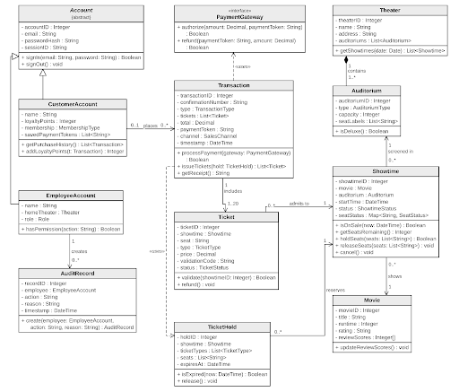
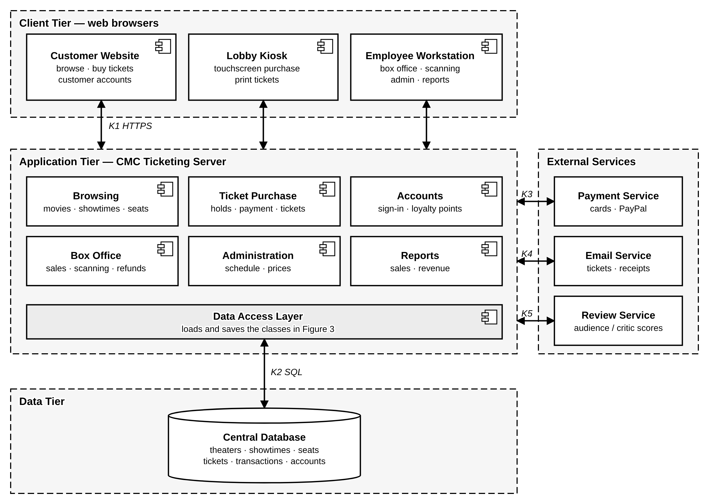

# Chinese Multi-Cinema (CMC) Ticketing System

**Software Requirements Specification**  
Version 1.0 · 24 September 2026

**Group #14:** Luke F., Matthew W., Joshua H.

Prepared for CS 250 - Introduction to Software Systems  
Instructor: Gus Hanna, Ph.D. · Fall 2026

---

# Revision History

| **Date**    | **Description**                             | **Author**                     | **Comments**                                                                                                                    |
|-------------|---------------------------------------------|--------------------------------|---------------------------------------------------------------------------------------------------------------------------------|
| 10 Sep 2026 | Version 0.1 - Title page and outline        | Luke F., Matthew W.            | Filled out title page with project name, date, group number, and names.                                                         |
| 17 Sep 2026 | Version 0.2 - Requirements draft            | Joshua H., Luke F., Matthew W. | Drafted Sections 1.1-3.1 and 3.5.                                                                                               |
| 24 Sep 2026 | Version 1.0 - Complete SRS (Sections 1-3.5) | Joshua H., Luke F., Matthew W. | Completed Sections 1-3.5: functional requirements, use-case diagram and descriptions, classes, and non-functional requirements. |

# Document Approval

The following Software Requirements Specification has been accepted and approved by the following:

| **Signature** | **Printed Name** | **Title**          | **Date** |
|---------------|------------------|--------------------|----------|
|               | Luke F.          | Software Eng.      | 9/24/26  |
|               | Matthew W.       | Software Eng.      | 9/24/26  |
|               | Joshua H.        | Software Eng.      | 9/24/26  |
|               | Dr. Gus Hanna    | Instructor, CS 250 |          |

## Table of Contents

- [Revision History](#revision-history)
- [Document Approval](#document-approval)
- [1. Introduction](#1-introduction)
  - [1.1 Purpose](#11-purpose)
  - [1.2 Scope](#12-scope)
  - [1.3 Definitions, Acronyms, and Abbreviations](#13-definitions-acronyms-and-abbreviations)
  - [1.4 References](#14-references)
  - [1.5 Overview](#15-overview)
- [2. General Description](#2-general-description)
  - [2.1 Product Perspective](#21-product-perspective)
  - [2.2 Product Functions (User Requirements)](#22-product-functions-user-requirements)
  - [2.3 User Characteristics](#23-user-characteristics)
  - [2.4 General Constraints](#24-general-constraints)
  - [2.5 Assumptions and Dependencies](#25-assumptions-and-dependencies)
- [3. Specific Requirements](#3-specific-requirements)
  - [3.1 External Interface Requirements](#31-external-interface-requirements)
    - [3.1.1 User Interfaces](#311-user-interfaces)
    - [3.1.2 Hardware Interfaces](#312-hardware-interfaces)
    - [3.1.3 Software Interfaces](#313-software-interfaces)
    - [3.1.4 Communications Interfaces](#314-communications-interfaces)
  - [3.2 Functional Requirements](#32-functional-requirements)
    - [3.2.1 Browse Movies and Showtimes](#321-browse-movies-and-showtimes)
    - [3.2.2 Select and Hold Tickets](#322-select-and-hold-tickets)
    - [3.2.3 Complete Purchase and Deliver Tickets](#323-complete-purchase-and-deliver-tickets)
    - [3.2.4 Customer Accounts and Membership](#324-customer-accounts-and-membership)
    - [3.2.5 Box Office Sales, Ticket Validation, and Refunds](#325-box-office-sales-ticket-validation-and-refunds)
    - [3.2.6 Administration](#326-administration)
    - [3.2.7 Reporting, Feedback, and Demand Protection](#327-reporting-feedback-and-demand-protection)
  - [3.3 Use Cases](#33-use-cases)
    - [3.3.1 Use Case #1 (UC-01): Browse Movies and Showtimes](#331-use-case-1-uc-01-browse-movies-and-showtimes)
    - [3.3.2 Use Case #2 (UC-02): Purchase Tickets](#332-use-case-2-uc-02-purchase-tickets)
    - [3.3.3 Use Case #3 (UC-03): Select Assigned Seats (extends UC-02)](#333-use-case-3-uc-03-select-assigned-seats-extends-uc-02)
    - [3.3.4 Use Case #4 (UC-04): Submit Satisfaction Rating (extends UC-02)](#334-use-case-4-uc-04-submit-satisfaction-rating-extends-uc-02)
    - [3.3.5 Use Case #5 (UC-05): Manage Account and Membership](#335-use-case-5-uc-05-manage-account-and-membership)
    - [3.3.6 Use Case #6 (UC-06): Sell Tickets at Box Office](#336-use-case-6-uc-06-sell-tickets-at-box-office)
    - [3.3.7 Use Case #7 (UC-07): Validate Ticket](#337-use-case-7-uc-07-validate-ticket)
    - [3.3.8 Use Case #8 (UC-08): Process Refund](#338-use-case-8-uc-08-process-refund)
    - [3.3.9 Use Case #9 (UC-09): Manage Movies, Showtimes and Pricing](#339-use-case-9-uc-09-manage-movies-showtimes-and-pricing)
    - [3.3.10 Use Case #10 (UC-10): Correct Transaction (Override)](#3310-use-case-10-uc-10-correct-transaction-override)
    - [3.3.11 Use Case #11 (UC-11): View Sales Reports](#3311-use-case-11-uc-11-view-sales-reports)
  - [3.4 Classes / Objects](#34-classes--objects)
    - [3.4.1 Theater](#341-theater)
    - [3.4.2 Auditorium](#342-auditorium)
    - [3.4.3 Movie](#343-movie)
    - [3.4.4 Showtime](#344-showtime)
    - [3.4.5 TicketHold](#345-tickethold)
    - [3.4.6 Ticket](#346-ticket)
    - [3.4.7 Transaction](#347-transaction)
    - [3.4.8 CustomerAccount](#348-customeraccount)
    - [3.4.9 EmployeeAccount](#349-employeeaccount)
    - [3.4.10 AuditRecord](#3410-auditrecord)
  - [3.5 Non-Functional Requirements](#35-non-functional-requirements)
    - [3.5.1 Performance](#351-performance)
    - [3.5.2 Reliability](#352-reliability)
    - [3.5.3 Availability](#353-availability)
    - [3.5.4 Security](#354-security)
    - [3.5.5 Maintainability](#355-maintainability)
    - [3.5.6 Portability](#356-portability)
    - [3.5.7 Usability and Accessibility](#357-usability-and-accessibility)
    - [4. Software Design Specification]
    - [4.1 System Description]
    - [4.2 Software Architecture Overview]
    - [4.3 UML Class Diagram]
    - [4.4 Class Descriptions]
    - 4.4.1 -> 4.4.x
    - [4.5 Development Plan and Timeline]
    - [4.5.1 Partitioning of Tasks]
    - [4.5.2 Team Member Responsibilities]

# 1. Introduction

Chinese Multi-Cinema (CMC) operates 20 movie theaters in the San Diego area. Its current ticketing software handles basic sales, but years of patches have made it slow and unreliable, and customers have no convenient way to buy tickets ahead of time. CMC needs a single, modern ticketing system shared by every theater, kiosk, and box office, so that customers can buy tickets in a few minutes from anywhere and every employee sees the same showtimes, prices, and seat availability.

The new CMC Ticketing System will let customers browse movies and showtimes, buy up to 20 tickets at a time, choose their seats in deluxe auditoriums, and receive tickets by email or as a printout, either as a guest or with an optional account that tracks loyalty points and membership. Theater employees will use the same system to sell, scan, and refund tickets, administrators will use it to manage movies, showtimes, and prices, and CMC management will use it to review sales across all locations. This document describes what the system must do and how well it must do it, not how it will be built.

## 1.1 Purpose

This Software Requirements Specification (SRS) defines the complete set of requirements for the CMC Ticketing System. It gives everyone involved one agreed description of the system before design and implementation begin, so that the finished product can be checked against it.

The intended audience is:

- **CMC management and theater staff**, who confirm that the requirements reflect their needs (mainly Sections 1 and 2)

- **Software designers and developers**, who build the system from the detailed requirements in Section 3

- **Testers** who write test cases from the numbered requirements and use cases

## 1.2 Scope

The software product specified here is the **CMC Ticketing System**, a browser-based ticketing platform used by the public website, in-theater self-service kiosks, and box-office workstations at all 20 CMC theaters.

**The system will:**

- show movies, showtimes, prices, remaining availability, and licensed review scores for every CMC theater.

- sell up to 20 tickets per transaction, with assigned seating in 75-seat deluxe auditoriums and general admission in 150-seat regular auditoriums.

- hold selected tickets for five minutes during checkout so they cannot be sold twice.

- accept card and PayPal payments through a third-party processor and deliver tickets by email or print.

- support guest checkout and optional customer accounts with purchase history, loyalty points, and CMC membership.

- let employees sell, validate, and refund tickets, and let administrators manage movies, showtimes, auditoriums, prices, and transaction corrections.

- provide sales and revenue reports to CMC management.

**The system will not** (in this release) include a native mobile app, online self-service refunds, concession or food ordering, automatic nearby-theater recommendations, or the processing and storage of raw card data (handled by the payment processor).

**Objectives.** The system is successful when: 90% of first-time customers can complete a purchase without help in a median time of three minutes or less; no assigned seat is ever sold twice; a sale on any channel appears on every other channel within two seconds; and the customer site is available at least 99.9% of each month. Section 3.5 states these objectives as measurable requirements.

## 1.3 Definitions, Acronyms, and Abbreviations

| **Term**                          | **Definition**                                                                                                        |
|-----------------------------------|-----------------------------------------------------------------------------------------------------------------------|
| **Administrator**                 | An authorized CMC employee who manages movies, showtimes, auditoriums, prices, and transaction corrections.           |
| **API**                           | Application Programming Interface; a defined way for two software systems to exchange data.                           |
| **Auditorium (regular / deluxe)** | A screening room. Regular auditoriums hold 150 general-admission seats; deluxe auditoriums hold 75 assigned seats.    |
| **CMC**                           | Chinese Multi-Cinema, the client organization.                                                                        |
| **Customer account**              | An optional account storing a customer's profile, purchase history, loyalty points, membership, and payment tokens.   |
| **Digital ticket**                | A ticket delivered electronically that carries a unique machine-readable validation code.                             |
| **MoSCoW**                        | Priority scheme used in this SRS: Must have, Should have, Could have (see Section 3).                                 |
| **Payment token**                 | A reference issued by the payment processor that stands in for card details; CMC never stores the card number itself. |
| **PCI DSS**                       | Payment Card Industry Data Security Standard.                                                                         |
| **Showtime**                      | A scheduled screening of a movie in a specific auditorium at a specific date and time.                                |
| **SRS**                           | Software Requirements Specification (this document).                                                                  |
| **Ticket hold**                   | A temporary five-minute reservation of selected tickets or seats created when checkout begins.                        |
| **TLS**                           | Transport Layer Security, the encryption used by HTTPS connections.                                                   |
| **Transaction**                   | A completed or attempted purchase, refund, or override recorded by the system.                                        |
| **UR / FR / NFR / UC**            | Prefixes for User Requirements, Functional Requirements, Non-Functional Requirements, and Use Cases.                  |

## 1.4 References

- IEEE Computer Society. *IEEE Recommended Practice for Software Requirements Specifications*, IEEE Std 830-1998. IEEE, 1998. Available from IEEE Xplore (ieeexplore.ieee.org).

- Object Management Group. *OMG Unified Modeling Language (UML)*, Version 2.5.1. OMG, December 2017. Available from omg.org/spec/UML.

- World Wide Web Consortium. *Web Content Accessibility Guidelines (WCAG) 2.1*, W3C Recommendation. Available from w3.org/TR/WCAG21.

- PCI Security Standards Council. *Payment Card Industry Data Security Standard*, Version 4.0. March 2022. Available from pcisecuritystandards.org.

- Software Engineering Tutorial (course reading), CS 250 - Introduction to Software Systems, Fall 2026.

## 1.5 Overview

The rest of this SRS moves from general to specific. **Section 2 - General Description** is written for non-technical readers: it explains the product's context, the user requirements (what each type of user needs to accomplish), the characteristics of those users, and the constraints, assumptions, and dependencies that shape the requirements. **Section 3 - Specific Requirements** contains the detailed, numbered requirements used by developers and testers: external interfaces (3.1), functional requirements grouped by feature (3.2), the use-case diagram and use-case descriptions (3.3), the main classes and objects (3.4), and measurable non-functional requirements (3.5).

# 2. General Description

This section describes the general factors that affect the CMC Ticketing System and its requirements. It does not state specific requirements; it provides the background that makes the requirements in Section 3 easier to understand.

## 2.1 Product Perspective

The CMC Ticketing System replaces CMC's existing ticketing software, which provides basic sales but has become slow and difficult to maintain. Unlike the current system, the new product gives all 20 theaters and all three sales channels, the public website, lobby kiosks, and box-office workstations, one shared source of movie, showtime, price, seat, and transaction information. A ticket sold at one theater's box office is immediately unavailable on the website, and vice versa.

The system is self-contained but depends on three external services: a **payment service** that authorizes and refunds card and PayPal payments, an **email service** that delivers confirmations and digital tickets, and a licensed **movie review service** that supplies audience and critic scores. It also works with the ticket printers and code scanners already installed in CMC theaters.

## 2.2 Product Functions (User Requirements)

The following user requirements summarize, in non-technical terms, what each group of users must be able to do. The last column traces each one to the functional requirements (Section 3.2) and use cases (Section 3.3) that refine it.

| **ID**    | **User requirement**                                                                           | **Users**          | **Refined by**                      |
|-----------|------------------------------------------------------------------------------------------------|--------------------|-------------------------------------|
| **UR-01** | Browse movies, showtimes, prices, seat availability, and review scores at any CMC theater.     | Customer, Employee | FR-01-06; UC-01                     |
| **UR-02** | Buy up to 20 tickets for a showtime in one purchase, online or at a kiosk.                     | Customer           | FR-07, 08, 10, 11, 13, 15-21; UC-02 |
| **UR-03** | Choose specific seats for deluxe showings; buy general-admission tickets for regular showings. | Customer           | FR-09, 12; UC-03                    |
| **UR-04** | Buy tickets as a guest or with an optional account.                                            | Customer           | FR-22, 23; UC-02, UC-05             |
| **UR-05** | Receive tickets by email or print them.                                                        | Customer           | FR-21; UC-02                        |
| **UR-06** | View purchase history, loyalty points, and CMC membership status in an account.                | Account holder     | FR-24-28; UC-05                     |
| **UR-07** | Give quick feedback on the purchase experience.                                                | Customer           | FR-44; UC-04                        |
| **UR-08** | Sell and print tickets for walk-up customers at the box office.                                | Theater employee   | FR-29; UC-06                        |
| **UR-09** | Scan tickets at the entrance and admit each ticket only once.                                  | Theater employee   | FR-30-32; UC-07                     |
| **UR-10** | Refund eligible tickets in person before the showtime starts.                                  | Theater employee   | FR-30, 33; UC-08                    |
| **UR-11** | Manage movies, showtimes, auditoriums, and ticket prices.                                      | Administrator      | FR-14, 34-37, 39, 40; UC-09         |
| **UR-12** | Correct customer purchasing mistakes with a recorded reason.                                   | Administrator      | FR-38, 39; UC-10                    |
| **UR-13** | See tickets sold and revenue by theater, movie, showtime, and date.                            | CMC management     | FR-41-43; UC-11                     |
| **UR-14** | Get fair access to tickets during high-demand releases, without bots buying them first.        | Customer           | FR-45, 46; UC-02                    |

## 2.3 User Characteristics

| **User class**       | **Characteristics**                                                                                  | **Needs that affect the requirements**                                                     |
|----------------------|------------------------------------------------------------------------------------------------------|--------------------------------------------------------------------------------------------|
| **Guest customer**   | Members of the public of any age and technical skill; occasional use; may prefer English or Spanish. | A short, simple purchase flow; clear prices before paying; no forced registration.         |
| **Account holder**   | Returning customers who buy frequently.                                                              | Saved history, loyalty points, membership benefits, and saved (tokenized) payment methods. |
| **Kiosk customer**   | Uses a shared public touchscreen, often in a hurry.                                                  | Large touch targets, very few steps, and automatic clearing of personal data.              |
| **Theater employee** | Box-office and usher staff; trained on the system; frequent daily use.                               | Fast selling, scanning, lookup, and refund tools that work under time pressure.            |
| **Administrator**    | Trained CMC operations staff with elevated permissions.                                              | Secure access to scheduling, pricing, and override functions with an audit trail.          |
| **CMC management**   | Business users who are not technical.                                                                | Summarized, filterable sales and revenue reports across all theaters.                      |

## 2.4 General Constraints

- The customer-facing system must run in a standard web browser; no native mobile application is required for the first release.

- The initial deployment serves 20 CMC theaters in the San Diego area, operating in Pacific Time and in U.S. dollars.

- Business rules set by CMC: at most 20 tickets per transaction; sales open 14 days before a showtime and close 10 minutes after it starts; a checkout hold lasts five minutes; regular auditoriums have 150 general-admission seats and deluxe auditoriums have 75 assigned seats.

- Prices and availability must be identical on every sales channel.

## 2.5 Assumptions and Dependencies

- Every CMC theater has a reliable internet connection. If this is not true, offline box-office sales would become a new requirement.

- Authorized employees enter accurate movie, auditorium, showtime, and price information.

- An approved third-party payment service is available for card and PayPal payments (and for Bitcoin, if CMC enables it).

- An external email service is available to deliver confirmations and digital tickets.

- CMC obtains a license or API agreement with a movie review provider; without it, review scores are omitted (FR-06 is a Should-have).

- Customers use a currently supported web browser (see NFR-PT-01).

- The ticket printers and code scanners at each theater are working and support standard barcode/QR formats.

# 3. Specific Requirements

This section contains the detailed requirements used to guide design, implementation, and testing. Each requirement has a unique ID, uses "shall" for anything mandatory, can be checked by testing or inspection, and traces back to a user requirement in Section 2.2.

Functional requirements carry a priority based on the MoSCoW scheme from the course reading (*Software Engineering Tutorial*): **Must** - the system is not operational without it; **Should** - important and expected in the first release; **Could** - desirable and included if time and budget allow.

## 3.1 External Interface Requirements

### 3.1.1 User Interfaces

| **ID**    | **Requirement**                                                                                                                                                                         |
|-----------|-----------------------------------------------------------------------------------------------------------------------------------------------------------------------------------------|
| **UI-01** | Before payment, the system shall display the movie, theater, date, showtime, auditorium type, ticket types and quantities, assigned seats (if any), fees, and total cost on one screen. |
| **UI-02** | The deluxe seat map shall visually distinguish available, held, selected, and sold seats, using both color and a text or symbol label.                                                  |
| **UI-03** | During checkout the interface shall continuously display the time remaining in the five-minute ticket hold.                                                                             |
| **UI-04** | All customer-facing screens shall be available in English and Spanish, selectable from every page.                                                                                      |
| **UI-05** | The kiosk interface shall use touch targets of at least 1.5 cm × 1.5 cm and shall complete a standard purchase in no more than six screens.                                             |
| **UI-06** | Employee and administrator functions shall be reachable only after sign-in and shall never be shown on customer-facing screens.                                                         |

### 3.1.2 Hardware Interfaces

| **ID**    | **Requirement**                                                                                                                                                                        |
|-----------|----------------------------------------------------------------------------------------------------------------------------------------------------------------------------------------|
| **HI-01** | The system shall run on customer computers and phones, theater kiosks, and employee workstations that have a supported web browser (NFR-PT-01); no special hardware shall be required. |
| **HI-02** | The system shall produce printable tickets and receipts compatible with CMC's existing ticket and receipt printers.                                                                    |
| **HI-03** | Each ticket shall carry a machine-readable code (QR code or barcode) readable by CMC's existing ticket scanners.                                                                       |
| **HI-04** | The kiosk interface shall support touchscreen input without a keyboard or mouse.                                                                                                       |

### 3.1.3 Software Interfaces

| **ID**    | **Requirement**                                                                                                                                                              |
|-----------|------------------------------------------------------------------------------------------------------------------------------------------------------------------------------|
| **SI-01** | The system shall send payment authorization and refund requests to an approved payment service and store only the returned status, transaction reference, and payment token. |
| **SI-02** | The system shall obtain movie review scores and critic information only through a licensed API from an approved review provider, not by copying content from websites.       |
| **SI-03** | The website, kiosks, and employee workstations shall read and update the same centralized ticket, seat, and price data.                                                      |
| **SI-04** | The system shall send confirmations and digital tickets through an approved email delivery service and record each message's delivery status.                                |

### 3.1.4 Communications Interfaces

| **ID**    | **Requirement**                                                                                                                           |
|-----------|-------------------------------------------------------------------------------------------------------------------------------------------|
| **CI-01** | All communication between clients and the server shall use HTTPS with TLS 1.2 or higher.                                                  |
| **CI-02** | Payment information shall be sent only to the approved payment service, over an encrypted connection.                                     |
| **CI-03** | Purchase confirmations and digital tickets shall be sent to the email address entered at checkout within two minutes of payment approval. |

## 3.2 Functional Requirements

Functional requirements are grouped by feature. Each feature follows the template structure of introduction, inputs, processing (the numbered requirements), outputs, and error handling.

### 3.2.1 Browse Movies and Showtimes

**3.2.1.1 Introduction.** Lets customers and employees find what is playing, when and where, what it costs, and how many seats remain.

**3.2.1.2 Inputs.** Theater, movie, date, and preferred language.

**3.2.1.3 Processing.**

| **ID**    | **Requirement**                                                                                                                              | **Priority** |
|-----------|----------------------------------------------------------------------------------------------------------------------------------------------|--------------|
| **FR-01** | The system shall display the movies scheduled at a selected CMC theater for a selected date.                                                 | Must         |
| **FR-02** | For each showtime the system shall display the date, start time, auditorium type, price for each ticket type, and number of seats remaining. | Must         |
| **FR-03** | The system shall let users filter showtimes by theater, movie, and date.                                                                     | Must         |
| **FR-04** | The system shall open ticket sales for a showtime exactly 14 calendar days before its start time and shall not sell tickets earlier.         | Must         |
| **FR-05** | The system shall close ticket sales for a showtime 10 minutes after its scheduled start time.                                                | Must         |
| **FR-06** | The system shall display audience and critic scores for each movie obtained from the licensed review service.                                | Should       |

**3.2.1.4 Outputs.** A list of matching movies and showtimes with auditorium type, prices, remaining availability, and review scores.

**3.2.1.5 Error Handling.** If no showtimes match the criteria, the system shall display a "no showtimes found" message and keep the user's filters so they can be changed. If the review service does not respond within two seconds, the system shall show the showtimes without review scores; browsing and purchasing shall continue normally.

### 3.2.2 Select and Hold Tickets

**3.2.2.1 Introduction.** Lets a customer choose ticket types and quantities (and seats, for deluxe showings) and reserves them while the customer pays.

**3.2.2.2 Inputs.** Showtime, ticket types (adult, child, student, senior, military/veteran), quantities, and deluxe seat selections.

**3.2.2.3 Processing.**

| **ID**    | **Requirement**                                                                                                                         | **Priority** |
|-----------|-----------------------------------------------------------------------------------------------------------------------------------------|--------------|
| **FR-07** | The system shall let the customer select a quantity for each ticket type offered for the showtime.                                      | Must         |
| **FR-08** | The system shall reject any selection that would place more than 20 tickets in one transaction.                                         | Must         |
| **FR-09** | For deluxe showtimes the system shall display a seat map and require the customer to choose one available seat per ticket.              | Must         |
| **FR-10** | For regular showtimes the system shall sell general-admission tickets and shall never sell more tickets than the auditorium's capacity. | Must         |
| **FR-11** | When checkout begins the system shall hold the selected tickets and seats for five minutes.                                             | Must         |
| **FR-12** | The system shall prevent a held or sold seat from being selected by any other customer on any channel.                                  | Must         |
| **FR-13** | The system shall release held tickets and seats automatically when the hold expires without an approved payment.                        | Must         |
| **FR-14** | The system shall price ticket types according to the rules configured by administrators (FR-37).                                        | Must         |

**3.2.2.4 Outputs.** An order summary listing the selected tickets, seats (if any), fees, total price, and hold expiration time.

**3.2.2.5 Error Handling.** If a selected seat or ticket becomes unavailable before the hold is created, the system shall identify it and ask the customer to choose again. When the hold expires, the system shall tell the customer, release the inventory, and allow the customer to restart the selection.

### 3.2.3 Complete Purchase and Deliver Tickets

**3.2.3.1 Introduction.** Collects payment for held tickets and issues valid tickets only after payment is approved.

**3.2.3.2 Inputs.** Held order, customer email address, payment method, and payment details (entered on the payment service's secure form).

**3.2.3.3 Processing.**

| **ID**    | **Requirement**                                                                                                          | **Priority** |
|-----------|--------------------------------------------------------------------------------------------------------------------------|--------------|
| **FR-15** | The system shall display an itemized total (UI-01) and require the customer to confirm it before payment is submitted.   | Must         |
| **FR-16** | The system shall accept credit cards, debit cards, and PayPal.                                                           | Must         |
| **FR-17** | The system shall accept Bitcoin through an approved cryptocurrency payment processor.                                    | Could        |
| **FR-18** | The system shall not issue valid tickets until the payment service approves the payment.                                 | Must         |
| **FR-19** | The system shall create exactly one transaction record, with a unique confirmation number, for each approved payment.    | Must         |
| **FR-20** | The system shall generate a unique, machine-readable validation code for every ticket issued.                            | Must         |
| **FR-21** | The system shall email the tickets and receipt to the customer and offer a printable version on the confirmation screen. | Must         |

**3.2.3.4 Outputs.** A confirmation screen with confirmation number and receipt; digital tickets by email; printed tickets on request.

**3.2.3.5 Error Handling.** If payment is declined, the system shall display the reason, issue no tickets, and let the customer try another payment method while the hold remains active. If the payment service's response is unknown (e.g., a timeout), the system shall query the transaction status before allowing another attempt, so the customer is never charged twice. If email delivery fails, tickets shall remain available from the confirmation screen, the customer account, or the box office.

### 3.2.4 Customer Accounts and Membership

**3.2.4.1 Introduction.** Provides optional accounts for returning customers, including purchase history, loyalty points, and CMC membership.

**3.2.4.2 Inputs.** Name, email address, password, membership selection, and saved payment choices.

**3.2.4.3 Processing.**

| **ID**    | **Requirement**                                                                                                                | **Priority** |
|-----------|--------------------------------------------------------------------------------------------------------------------------------|--------------|
| **FR-22** | The system shall let customers purchase tickets as guests by providing only an email address and payment.                      | Must         |
| **FR-23** | The system shall let customers create an optional account using an email address and password.                                 | Should       |
| **FR-24** | The system shall let account holders view their past and upcoming purchases and re-send or print their tickets.                | Should       |
| **FR-25** | The system shall award loyalty points on each purchase at the rate configured by CMC and display the current balance.          | Should       |
| **FR-26** | The system shall let account holders save payment methods, storing only payment tokens (NFR-S-03).                             | Should       |
| **FR-27** | The system shall allow only one active sign-in session per account; signing in on a new device shall end the previous session. | Must         |
| **FR-28** | The system shall let account holders purchase a CMC membership and apply its benefits at checkout.                             | Could        |

**3.2.4.4 Outputs.** An updated profile, purchase history, loyalty balance, or membership status.

**3.2.4.5 Error Handling.** The system shall reject registration with an email address already in use and shall reject invalid sign-in credentials with a message that does not reveal which field was wrong. An expired membership shall not be applied at checkout; the customer shall be told it has expired.

### 3.2.5 Box Office Sales, Ticket Validation, and Refunds

**3.2.5.1 Introduction.** Supports theater employees selling tickets in person, admitting customers, and handling refunds.

**3.2.5.2 Inputs.** Employee credentials, showtime and ticket selections, ticket codes (scanned or typed), confirmation numbers or customer email addresses, and refund reasons.

**3.2.5.3 Processing.**

| **ID**    | **Requirement**                                                                                                                                                               | **Priority** |
|-----------|-------------------------------------------------------------------------------------------------------------------------------------------------------------------------------|--------------|
| **FR-29** | The system shall let employees sell and print tickets for walk-up customers using the same inventory, prices, and rules as online sales.                                      | Must         |
| **FR-30** | The system shall let employees find a transaction by confirmation number, ticket code, or customer email address.                                                             | Must         |
| **FR-31** | The system shall validate a ticket from its scanned or typed code and display one of: valid, already used, refunded, wrong showtime, or not found.                            | Must         |
| **FR-32** | The system shall mark a ticket as redeemed on its first successful validation and reject every later attempt.                                                                 | Must         |
| **FR-33** | The system shall let authorized employees refund eligible tickets in person before the showtime starts, invalidate the refunded tickets, and return their seats to inventory. | Must         |

**3.2.5.4 Outputs.** Printed tickets and receipts, validation results, and refund confirmations.

**3.2.5.5 Error Handling.** The system shall reject refunds requested after the showtime has started and refunds of tickets that have been redeemed or already refunded. If the payment service rejects a refund, the ticket shall remain valid and the employee shall be shown the reason.

### 3.2.6 Administration

**3.2.6.1 Introduction.** Lets administrators maintain the movie, showtime, auditorium, and price data and record each change.

**3.2.6.2 Inputs.** Administrator credentials; movie, showtime, auditorium, and price data; override reasons.

**3.2.6.3 Processing.**

| **ID**    | **Requirement**                                                                                                                                             | **Priority** |
|-----------|-------------------------------------------------------------------------------------------------------------------------------------------------------------|--------------|
| **FR-34** | The system shall let administrators create, modify, and cancel movies and showtimes.                                                                        | Must         |
| **FR-35** | The system shall assign each showtime to an auditorium and reject showtimes that overlap in the same auditorium.                                            | Must         |
| **FR-36** | The system shall let administrators configure each auditorium's type (regular or deluxe), capacity, and seat layout.                                        | Must         |
| **FR-37** | The system shall let administrators configure ticket prices (ticket type and amount)                                                                        | Must         |
| **FR-38** | The system shall let administrators correct a customer's purchase (e.g., wrong showtime or ticket type) through an override that requires a written reason. | Should       |
| **FR-39** | The system shall record the employee ID, action, reason, and timestamp for every refund, override, and price or schedule change.                            | Must         |
| **FR-40** | When a showtime with sold tickets is cancelled, the system shall mark all affected tickets as refund-eligible and list them for follow-up.                  | Should       |

**3.2.6.4 Outputs.** Updated schedules, prices, and auditorium settings, available on all channels within two seconds; audit records.

**3.2.6.5 Error Handling.** The system shall reject overlapping showtimes, negative or missing prices, and overrides without a reason, and shall explain why. Unauthorized users attempting administrative functions shall be denied and the attempt shall be logged (NFR-S-04).

### 3.2.7 Reporting, Feedback, and Demand Protection

**3.2.7.1 Introduction.** Gives management visibility into sales, collects customer feedback, and keeps the system fair and responsive during high-demand releases.

**3.2.7.2 Inputs.** Report filters (date range, theater, movie, showtime), completed transactions, feedback ratings, and traffic measurements.

**3.2.7.3 Processing.**

| **ID**    | **Requirement**                                                                                                                                  | **Priority** |
|-----------|--------------------------------------------------------------------------------------------------------------------------------------------------|--------------|
| **FR-41** | The system shall record every completed purchase and refund in a system-wide daily transaction log.                                              | Must         |
| **FR-42** | The system shall let management users view tickets sold and revenue by theater, movie, showtime, and date range.                                 | Must         |
| **FR-43** | The system shall let management users export any report as a CSV file.                                                                           | Could        |
| **FR-44** | After a completed purchase the system shall offer an optional 1-5 satisfaction rating and store it with the transaction.                         | Could        |
| **FR-45** | When checkout demand exceeds capacity, the system shall place new customers in a first-come, first-served waiting queue and show their position. | Should       |
| **FR-46** | The system shall detect and block automated (bot) purchasing, as specified in NFR-S-08.                                                          | Should       |

**3.2.7.4 Outputs.** Sales and revenue reports, CSV exports, stored feedback, and queue-position messages.

**3.2.7.5 Error Handling.** If no records match a report's filters, the system shall display an empty report rather than an error. If report generation fails, transaction data shall remain unchanged and the user shall be notified. A customer in the queue shall keep their place if the page is refreshed.

## 3.3 Use Cases

Figure 1 shows every actor and use case of the CMC Ticketing System. Actors on the left are people who start use cases; actors on the right are external systems that the CMC system calls on. A solid line means the actor takes part in the use case. A dashed «extend» arrow means the extending use case adds optional behavior to the base use case under a stated condition. A text description of each use case follows the figure.

*Figure 1. Use-case diagram for the CMC Ticketing System*

### 3.3.1 Use Case #1 (UC-01): Browse Movies and Showtimes

| **Description**                 | A customer looks up what is playing at a CMC theater and picks a showtime.                                                                                                                                                                                                                                                                             |
|---------------------------------|--------------------------------------------------------------------------------------------------------------------------------------------------------------------------------------------------------------------------------------------------------------------------------------------------------------------------------------------------------|
| **Actors**                      | Primary: Customer. Secondary: Movie Review Service.                                                                                                                                                                                                                                                                                                    |
| **Related requirements**        | FR-01 - FR-06; UR-01                                                                                                                                                                                                                                                                                                                                   |
| **Precondition / trigger**      | At least one showtime has been scheduled by an administrator. *Trigger:* The customer opens the CMC website or kiosk.                                                                                                                                                                                                                                  |
| **Main success scenario**       | 1. The customer selects a theater and date. 2. The system displays the movies and showtimes for that theater and date. 3. The customer selects a movie. 4. The system displays each showtime's time, auditorium type, prices, seats remaining, and review scores. 5. The customer selects a showtime to buy tickets (continues in UC-02). |
| **Alternate / exception flows** | **2a.** No showtimes match: the system shows a no-results message and the customer changes the filters. **4a.** The review service is unavailable: the system shows the showtimes without scores. **5a.** The showtime is outside its sales window: the system shows when sales open or that sales have closed.                                  |
| **Postconditions**              | No data is changed; the customer has either chosen a showtime or left.                                                                                                                                                                                                                                                                                 |

### 3.3.2 Use Case #2 (UC-02): Purchase Tickets

| **Description**                 | A customer buys tickets online or at a kiosk and receives them by email or print.                                                                                                                                                                                                                                                                                                                                                                                                                                                                                                                                                                                                                                                                                                      |
|---------------------------------|----------------------------------------------------------------------------------------------------------------------------------------------------------------------------------------------------------------------------------------------------------------------------------------------------------------------------------------------------------------------------------------------------------------------------------------------------------------------------------------------------------------------------------------------------------------------------------------------------------------------------------------------------------------------------------------------------------------------------------------------------------------------------------------|
| **Actors**                      | Primary: Customer. Secondary: Payment Service, Email Service.                                                                                                                                                                                                                                                                                                                                                                                                                                                                                                                                                                                                                                                                                                                          |
| **Related requirements**        | FR-07 - FR-22, FR-45, FR-46; UR-02, UR-04, UR-05, UR-14                                                                                                                                                                                                                                                                                                                                                                                                                                                                                                                                                                                                                                                                                                                                |
| **Precondition / trigger**      | A showtime inside its sales window has been selected (UC-01). *Trigger:* The customer chooses "Buy tickets".                                                                                                                                                                                                                                                                                                                                                                                                                                                                                                                                                                                                                                                                           |
| **Main success scenario**       | 1. The system displays the available ticket types and prices. 2. The customer selects ticket types and quantities (20 or fewer). 3. **Extension point - seat selection:** if the showing is deluxe, UC-03 is performed. 4. The system holds the selection for five minutes and starts the countdown. 5. The customer continues as a guest (email address) or signs in. 6. The system displays the itemized total; the customer confirms and enters payment. 7. The payment service approves the payment. 8. The system records one transaction, issues tickets with unique codes, and removes them from inventory. 9. The system displays the confirmation and emails the tickets and receipt. 10. **Extension point - feedback:** UC-04 may be performed. |
| **Alternate / exception flows** | **2a.** More than 20 tickets requested: the system blocks the selection and explains the limit. **4a.** High demand: the customer is placed in the waiting queue and continues when a checkout slot is free. **7a.** Payment declined: no tickets are issued; the customer may try another method while the hold is active. **7b.** Hold expires before approval: the system releases the inventory and asks the customer to start again. **9a.** Email fails: tickets remain printable from the confirmation screen and retrievable at the box office.                                                                                                                                                                                                                    |
| **Postconditions**              | Payment is captured once, tickets are valid, and the purchased seats are unavailable on every channel.                                                                                                                                                                                                                                                                                                                                                                                                                                                                                                                                                                                                                                                                                 |

### 3.3.3 Use Case #3 (UC-03): Select Assigned Seats (extends UC-02)

| **Description**                 | For a deluxe showing, the customer chooses specific seats on a seat map.                                                                                                                                                                  |
|---------------------------------|-------------------------------------------------------------------------------------------------------------------------------------------------------------------------------------------------------------------------------------------|
| **Actors**                      | Primary: Customer (through UC-02). Secondary: None.                                                                                                                                                                                       |
| **Related requirements**        | FR-09, FR-12; UR-03                                                                                                                                                                                                                       |
| **Precondition / trigger**      | UC-02 is in progress for a deluxe showtime. *Trigger:* UC-02 reaches the seat-selection extension point.                                                                                                                                  |
| **Main success scenario**       | 1. The system displays the auditorium seat map with available, held, and sold seats. 2. The customer selects one seat per ticket. 3. The system confirms that each seat is still available. 4. Control returns to UC-02 step 4. |
| **Alternate / exception flows** | **3a.** A seat was taken by another customer: the system marks it unavailable and asks the customer to choose another.                                                                                                                    |
| **Postconditions**              | The chosen seats are ready to be held for this customer.                                                                                                                                                                                  |

### 3.3.4 Use Case #4 (UC-04): Submit Satisfaction Rating (extends UC-02)

| **Description**                 | After a purchase, the customer optionally rates the experience.                                                                 |
|---------------------------------|---------------------------------------------------------------------------------------------------------------------------------|
| **Actors**                      | Primary: Customer (through UC-02). Secondary: None.                                                                             |
| **Related requirements**        | FR-44; UR-07                                                                                                                    |
| **Precondition / trigger**      | UC-02 has completed successfully. *Trigger:* The confirmation screen displays the rating control.                               |
| **Main success scenario**       | 1. The customer selects a rating from 1 to 5. 2. The system stores the rating with the transaction and thanks the customer. |
| **Alternate / exception flows** | **1a.** The customer ignores or closes the rating control: nothing is stored.                                                   |
| **Postconditions**              | The rating, if given, is linked to the transaction.                                                                             |

### 3.3.5 Use Case #5 (UC-05): Manage Account and Membership

| **Description**                 | A customer creates or maintains an optional account.                                                                                                                                                                                                                                                                                                        |
|---------------------------------|-------------------------------------------------------------------------------------------------------------------------------------------------------------------------------------------------------------------------------------------------------------------------------------------------------------------------------------------------------------|
| **Actors**                      | Primary: Customer (account holder). Secondary: None.                                                                                                                                                                                                                                                                                                        |
| **Related requirements**        | FR-23 - FR-28; UR-04, UR-06                                                                                                                                                                                                                                                                                                                                 |
| **Precondition / trigger**      | None for registration; an existing account for all other actions. *Trigger:* The customer selects "Create account" or "My account".                                                                                                                                                                                                                         |
| **Main success scenario**       | 1. The customer registers or signs in. 2. The system ends any other active session for the account. 3. The system displays purchase history, upcoming tickets, loyalty points, and membership status. 4. The customer updates the profile, removes a saved payment method, or buys a membership. 5. The system validates and saves the change. |
| **Alternate / exception flows** | **1a.** Email already registered or invalid credentials: the request is rejected with a general message. **4a.** Membership payment declined: membership status is unchanged.                                                                                                                                                                            |
| **Postconditions**              | Account data is saved; no card numbers are stored.                                                                                                                                                                                                                                                                                                          |

### 3.3.6 Use Case #6 (UC-06): Sell Tickets at Box Office

| **Description**                 | An employee sells tickets to a walk-up customer.                                                                                                                                                                                                                                                                                                            |
|---------------------------------|-------------------------------------------------------------------------------------------------------------------------------------------------------------------------------------------------------------------------------------------------------------------------------------------------------------------------------------------------------------|
| **Actors**                      | Primary: Theater employee. Secondary: Payment Service, Email Service.                                                                                                                                                                                                                                                                                       |
| **Related requirements**        | FR-29, FR-07 - FR-21; UR-08                                                                                                                                                                                                                                                                                                                                 |
| **Precondition / trigger**      | The employee is signed in at a box-office workstation. *Trigger:* A customer asks to buy tickets at the counter.                                                                                                                                                                                                                                            |
| **Main success scenario**       | 1. The employee selects the showtime, ticket types, and quantities (and seats for deluxe showings). 2. The system holds the selection. 3. The employee takes payment through the payment service. 4. The system records the transaction and issues tickets. 5. The employee prints the tickets and, if requested, emails them to the customer. |
| **Alternate / exception flows** | **2a.** Tickets were just sold on another channel: the system shows current availability and the employee re-selects. **3a.** Payment declined: no tickets are issued.                                                                                                                                                                                   |
| **Postconditions**              | The sale is recorded and inventory is updated on every channel.                                                                                                                                                                                                                                                                                             |

### 3.3.7 Use Case #7 (UC-07): Validate Ticket

| **Description**                 | An employee admits a customer by scanning the ticket.                                                                                                                                                                                              |
|---------------------------------|----------------------------------------------------------------------------------------------------------------------------------------------------------------------------------------------------------------------------------------------------|
| **Actors**                      | Primary: Theater employee. Secondary: None (ticket scanner is a device used by the employee).                                                                                                                                                      |
| **Related requirements**        | FR-30 - FR-32; UR-09                                                                                                                                                                                                                               |
| **Precondition / trigger**      | The employee is signed in; the ticket was issued for a showtime at this theater. *Trigger:* The customer presents a printed or digital ticket.                                                                                                     |
| **Main success scenario**       | 1. The employee scans the ticket code (or types it). 2. The system checks the ticket's showtime, status, and validation history. 3. The system marks the ticket as redeemed. 4. The system displays "valid" and the auditorium and seat. |
| **Alternate / exception flows** | **2a.** Unknown, refunded, wrong-showtime, or already-used ticket: the system displays the reason and does not mark it redeemed.                                                                                                                   |
| **Postconditions**              | A valid ticket has been redeemed exactly once.                                                                                                                                                                                                     |

### 3.3.8 Use Case #8 (UC-08): Process Refund

| **Description**                 | An employee refunds eligible tickets in person.                                                                                                                                                                                                                                                                                                                                                                                                        |
|---------------------------------|--------------------------------------------------------------------------------------------------------------------------------------------------------------------------------------------------------------------------------------------------------------------------------------------------------------------------------------------------------------------------------------------------------------------------------------------------------|
| **Actors**                      | Primary: Theater employee. Secondary: Payment Service.                                                                                                                                                                                                                                                                                                                                                                                                 |
| **Related requirements**        | FR-30, FR-33, FR-39; UR-10                                                                                                                                                                                                                                                                                                                                                                                                                             |
| **Precondition / trigger**      | The employee is signed in with refund permission; the showtime has not started. *Trigger:* A customer asks for a refund at the box office.                                                                                                                                                                                                                                                                                                             |
| **Main success scenario**       | 1. The employee finds the transaction by confirmation number, ticket code, or email. 2. The system shows the tickets and which are eligible for refund. 3. The employee selects tickets and enters a reason. 4. The system sends the refund to the payment service. 5. The system invalidates the refunded tickets, returns the seats to inventory, and records the audit entry. 6. The system prints or emails a refund confirmation. |
| **Alternate / exception flows** | **2a.** Showtime already started, or ticket already used or refunded: the refund is refused. **4a.** Payment service rejects the refund: tickets stay valid and the employee sees the reason.                                                                                                                                                                                                                                                       |
| **Postconditions**              | The refund and its audit record are stored, and refunded seats are available for sale.                                                                                                                                                                                                                                                                                                                                                                 |

### 3.3.9 Use Case #9 (UC-09): Manage Movies, Showtimes and Pricing

| **Description**                 | An administrator maintains the schedule, auditoriums, and prices.                                                                                                                                                                                                                                                                                                                        |
|---------------------------------|------------------------------------------------------------------------------------------------------------------------------------------------------------------------------------------------------------------------------------------------------------------------------------------------------------------------------------------------------------------------------------------|
| **Actors**                      | Primary: Administrator. Secondary: None.                                                                                                                                                                                                                                                                                                                                                 |
| **Related requirements**        | FR-34 - FR-37, FR-39, FR-40; UR-11                                                                                                                                                                                                                                                                                                                                                       |
| **Precondition / trigger**      | The administrator is signed in with administrative permission. *Trigger:* The administrator opens the admin page.                                                                                                                                                                                                                                                                        |
| **Main success scenario**       | 1. The administrator selects movies, showtimes, auditoriums, or prices. 2. The system displays the current values. 3. The administrator enters changes. 4. The system checks for overlapping showtimes, capacity conflicts, and invalid prices. 5. The administrator confirms. 6. The system saves the change, records an audit entry, and publishes it to all channels. |
| **Alternate / exception flows** | **4a.** Conflict or invalid value: the change is rejected with an explanation. **6a.** A cancelled showtime has sold tickets: the affected tickets are marked refund-eligible and listed for follow-up.                                                                                                                                                                               |
| **Postconditions**              | Valid changes are live on every channel and recorded in the audit log.                                                                                                                                                                                                                                                                                                                   |

### 3.3.10 Use Case #10 (UC-10): Correct Transaction (Override)

| **Description**                 | An administrator fixes a customer's purchasing mistake.                                                                                                                                                                                                                                                                                                                             |
|---------------------------------|-------------------------------------------------------------------------------------------------------------------------------------------------------------------------------------------------------------------------------------------------------------------------------------------------------------------------------------------------------------------------------------|
| **Actors**                      | Primary: Administrator. Secondary: Payment Service.                                                                                                                                                                                                                                                                                                                                 |
| **Related requirements**        | FR-38, FR-39; UR-12                                                                                                                                                                                                                                                                                                                                                                 |
| **Precondition / trigger**      | The administrator is signed in; the transaction exists and its showtime has not started. *Trigger:* A customer or employee reports a purchasing error.                                                                                                                                                                                                                              |
| **Main success scenario**       | 1. The administrator finds the transaction. 2. The administrator selects the correction (e.g., change showtime or ticket type) and enters a reason. 3. The system calculates any price difference and, if needed, charges or refunds it through the payment service. 4. The system reissues the corrected tickets, invalidates the old ones, and records the audit entry. |
| **Alternate / exception flows** | **2a.** No reason entered: the override is refused. **3a.** The price-difference payment fails: no change is made.                                                                                                                                                                                                                                                               |
| **Postconditions**              | The customer holds corrected, valid tickets; the original tickets are invalid; the override is audited.                                                                                                                                                                                                                                                                             |

### 3.3.11 Use Case #11 (UC-11): View Sales Reports

| **Description**                 | A CMC manager reviews ticket sales and revenue.                                                                                                                                                                                                                                  |
|---------------------------------|----------------------------------------------------------------------------------------------------------------------------------------------------------------------------------------------------------------------------------------------------------------------------------|
| **Actors**                      | Primary: CMC management. Secondary: None.                                                                                                                                                                                                                                        |
| **Related requirements**        | FR-41 - FR-43; UR-13                                                                                                                                                                                                                                                             |
| **Precondition / trigger**      | The user is signed in with reporting permission. *Trigger:* The user opens the reports page.                                                                                                                                                                                     |
| **Main success scenario**       | 1. The user selects a date range and, optionally, theaters, movies, or showtimes. 2. The system retrieves the matching transactions. 3. The system calculates tickets sold and revenue, minus refunds. 4. The system displays the report, with an option to export it. |
| **Alternate / exception flows** | **2a.** No matching records: an empty report is shown. **3a.** Report generation fails: the user is notified; data is unchanged.                                                                                                                                              |
| **Postconditions**              | The report is displayed; no transaction data is modified.                                                                                                                                                                                                                        |

## 3.4 Classes / Objects

The following conceptual classes represent the main information the system manages. They describe required data and responsibilities without prescribing a programming language or final design.

### 3.4.1 Theater

A CMC theater location.

**3.4.1.1 Attributes:**

- theaterID : Integer
- name : String
- address : String
- phoneNumber : String
- auditoriums : String[]

**3.4.1.2 Functions:**

- getShowtimes(date) : String[] - returns the showtimes scheduled at this theater
- getAuditoriums() : String[] - returns the theater's auditoriums.

*Related requirements and use cases:* FR-01, FR-03, FR-42; UC-01, UC-11

### 3.4.2 Auditorium

A screening room within a theater.

**3.4.2.1 Attributes:**

- auditoriumID : Integer
- theaterID : Integer
- type (Regular or Deluxe) : Enum
- capacity (150 or 75) : Integer
- seatLayout (row and number of each deluxe seat) : String[][]

**3.4.2.2 Functions:**

- isDeluxe() : Boolean - tells whether seats are assigned
- getSeatLayout() : String[][] - returns the seats in the room.

*Related requirements and use cases:* FR-09, FR-10, FR-36; UC-03, UC-09

### 3.4.3 Movie

A film that CMC is showing.

**3.4.3.1 Attributes:**

- movieID : Integer
- title : String
- runtime : Integer
- mpaaRating : String
- synopsis : String
- audienceCriticScores (from the review service) : Integer[]

**3.4.3.2 Functions:**

- getReviewScores() : Integer[] - retrieves current scores from the review service.

*Related requirements and use cases:* FR-01, FR-06, FR-34; UC-01, UC-09

### 3.4.4 Showtime

One screening of a movie in an auditorium, including the status of every seat for that screening.

**3.4.4.1 Attributes:**

- showtimeID : Integer
- movieID : Integer
- auditoriumID : Integer
- startDateAndTime : DateTime
- status (Scheduled, On Sale, Closed, Cancelled) : Enum
- salesOpen (start − 14 days) : DateTime
- salesClose (start + 10 minutes) : DateTime
- seatsRemaining : Integer
- deluxeSeatStatus (Available, Held, Sold) : Enum

**3.4.4.2 Functions:**

- isOnSale(now) : Boolean - applies the sales window
- holdSeats(), releaseSeats(), markSold() : void - change seat status so only one customer can hold or buy a seat.
- cancel() : void - cancels the showtime and flags affected tickets.

*Related requirements and use cases:* FR-02, FR-04, FR-05, FR-09, FR-12, FR-13, FR-34, FR-35, FR-40; UC-01, UC-03, UC-09

### 3.4.5 TicketHold

A temporary reservation made when checkout begins.

**3.4.5.1 Attributes:**

- holdID : Integer
- showtimeID : Integer
- selectedTicketsAndSeats : String[]
- createdAt : DateTime
- expiresAt (createdAt + 5 minutes) : DateTime

**3.4.5.2 Functions:**

- isExpired() : Boolean - true after five minutes.
- release() : void - returns tickets and seats to inventory.

*Related requirements and use cases:* FR-11, FR-13; UC-02, UC-06

### 3.4.6 Ticket

Admission for one person to one showtime.

**3.4.6.1 Attributes:**

- ticketID : Integer
- validationCode : String
- showtimeID : Integer
- seat : String
- ticketType : Enum
- pricePaid : Decimal
- status (Issued, Redeemed, Refunded) : Enum

**3.4.6.2 Functions:**

- validate() : Boolean - redeems the ticket once and rejects later attempts;
- refund() : void - marks the ticket refunded and frees its seat.

*Related requirements and use cases:* FR-20, FR-31 - FR-33; UC-07, UC-08

### 3.4.7 Transaction

A purchase, refund, or override.

**3.4.7.1 Attributes:**

- transactionID : Integer
- confirmationNumber : Integer
- type (Purchase, Refund, Override) : Enum
- tickets : Ticket[]
- subtotal : Decimal
- fees : Decimal
- total : Decimal
- paymentToken : String
- status : Enum
- salesChannel (Web, Kiosk, Box Office) : Enum
- timestamp : DateTime
- satisfactionRating (1-5) : Integer

**3.4.7.2 Functions:**

- authorizePayment() : void - requests approval from the payment service
- issueTickets() : void - creates tickets after approval
- getReceipt() : void - produces the receipt.

*Related requirements and use cases:* FR-15 - FR-19, FR-29, FR-41, FR-44; UC-02, UC-04, UC-06, UC-08, UC-10

### 3.4.8 CustomerAccount

An optional customer account.

**3.4.8.1 Attributes:**

- customerID : Integer
- name : String
- email : String
- passwordHash : String
- savedPaymentTokens : String
- loyaltyPointBalance : Integer
- membershipType : Enum
- membershipNumber : Integer
- activeSessionID : Integer

**3.4.8.2 Functions:**

- signIn() : void - starts a session and ends any previous one
- getPurchaseHistory() : String[] - lists past and upcoming purchases
- addLoyaltyPoints(transaction) : Integer - awards points.

*Related requirements and use cases:* FR-22 - FR-28; UC-05

### 3.4.9 EmployeeAccount

A CMC staff account.

**3.4.9.1 Attributes:**

- employeeID : Integer
- name : String
- home theater : Integer
- role (Box Office, Administrator, Manager) : Enum
- passwordHash: String

**3.4.9.2 Functions:**

- hasPermission(action) : Boolean - checks role-based access before any employee function.

*Related requirements and use cases:* FR-29 - FR-42; UC-06 - UC-11

### 3.4.10 AuditRecord

A permanent record of a sensitive employee action.

**3.4.10.1 Attributes:**

- recordID : Integer
- employeeID : Integer
- action : String
- reason : String
- relatedData : String - the data that the audit pertains to
- timestamp : DateTime

**3.4.10.2 Functions:**

- create() : void - records are write-once and cannot be edited or deleted by users.

*Related requirements and use cases:* FR-38, FR-39; UC-08 - UC-10

## 3.5 Non-Functional Requirements

The following quality requirements apply to the whole system and are stated in measurable terms. "Normal load" means up to 1,000 concurrent users.

### 3.5.1 Performance

| **ID**       | **Requirement**                                                                                                                 |
|--------------|---------------------------------------------------------------------------------------------------------------------------------|
| **NFR-P-01** | The system shall support at least 1,000 concurrent users while meeting NFR-P-02 through NFR-P-04.                               |
| **NFR-P-02** | 95% of browse and search pages shall load within 2 seconds under normal load.                                                   |
| **NFR-P-03** | 95% of seat-selection, hold, and checkout steps shall complete within 3 seconds, excluding the payment service's response time. |
| **NFR-P-04** | A change in ticket or seat availability shall appear on every sales channel within 2 seconds.                                   |
| **NFR-P-05** | 99% of ticket validations (scan to result) shall complete within 1 second.                                                      |

### 3.5.2 Reliability

| **ID**       | **Requirement**                                                                                                                            |
|--------------|--------------------------------------------------------------------------------------------------------------------------------------------|
| **NFR-R-01** | Each approved payment shall produce exactly one transaction, even if the customer submits the order more than once.                        |
| **NFR-R-02** | No assigned seat shall ever be sold to more than one customer, verified by a test in which 500 simultaneous requests target the same seat. |
| **NFR-R-03** | Inventory from expired holds and failed payments shall be released within 10 seconds of the hold's expiration.                             |
| **NFR-R-04** | The database shall be backed up automatically at least every 24 hours, and backups shall be kept for at least 30 days.                     |
| **NFR-R-05** | After a system failure, no confirmed purchase or refund shall be lost, and at most 15 minutes of other data may need to be re-entered.     |

### 3.5.3 Availability

| **ID**       | **Requirement**                                                                                                                                                                 |
|--------------|---------------------------------------------------------------------------------------------------------------------------------------------------------------------------------|
| **NFR-A-01** | The customer ticketing service shall be available at least 99.9% of each calendar month (no more than about 43 minutes of unplanned downtime), excluding scheduled maintenance. |
| **NFR-A-02** | Scheduled maintenance shall take place only between 2:00 a.m. and 6:00 a.m. Pacific Time.                                                                                       |
| **NFR-A-03** | Customers and employees shall receive at least 24 hours' notice of scheduled maintenance.                                                                                       |
| **NFR-A-04** | If any one server fails it shall not interrupt ticket sales for more than 5 minutes.                                                                                            |
| **NFR-A-05** | An outage of the movie review service or email service shall not stop browsing, purchasing, or validation.                                                                      |

### 3.5.4 Security

| **ID**       | **Requirement**                                                                                                                                                |
|--------------|----------------------------------------------------------------------------------------------------------------------------------------------------------------|
| **NFR-S-01** | All data in transit shall be encrypted with TLS 1.2 or higher; personal data at rest shall be encrypted.                                                       |
| **NFR-S-02** | Passwords shall be stored only as salted hashes (e.g., using bcrypt), never as plain text.                                                                     |
| **NFR-S-03** | The system shall never store full card numbers or security codes; card handling shall comply with PCI DSS through the payment service's tokenization.          |
| **NFR-S-04** | Every employee function shall require sign-in and role-based permission (Box Office, Administrator, Manager).                                                  |
| **NFR-S-05** | An employee account shall be locked for 15 minutes after 5 failed sign-in attempts, and all employee sign-in attempts shall be logged.                         |
| **NFR-S-06** | Ticket validation codes shall be randomly generated values at least 128 bits long so they cannot be guessed or forged.                                         |
| **NFR-S-07** | Kiosks shall erase all customer and payment information at the end of each session or after 60 seconds of inactivity.                                          |
| **NFR-S-08** | The system shall challenge (e.g., with a CAPTCHA) any device or account making more than 10 checkout attempts per minute and block it after repeated failures. |

### 3.5.5 Maintainability

| **ID**       | **Requirement**                                                                                                                                           |
|--------------|-----------------------------------------------------------------------------------------------------------------------------------------------------------|
| **NFR-M-01** | Theaters, auditoriums, showtimes, prices, and sales-window settings shall be changeable through the administrator interface without changing source code. |
| **NFR-M-02** | Every logged error shall include a timestamp, component, severity, request or transaction ID, and message; error logs shall be kept for 90 days.          |
| **NFR-M-03** | Automated tests shall cover at least 80% of the server code.                                                                                              |
| **NFR-M-04** | Software updates shall be installable without losing transaction, account, ticket, or configuration data.                                                 |

### 3.5.6 Portability

| **ID**        | **Requirement**                                                                                                                  |
|---------------|----------------------------------------------------------------------------------------------------------------------------------|
| **NFR-PT-01** | The customer and employee interfaces shall work in the current and previous major versions of Chrome, Safari, Firefox, and Edge. |
| **NFR-PT-02** | Customers shall not need to install any application or plug-in.                                                                  |
| **NFR-PT-03** | Layouts shall adapt to screen widths from 360 pixels (phones) to 1920 pixels (desktops and kiosks).                              |
| **NFR-PT-04** | Employee workstations shall be able to run the system on Windows, macOS, or ChromeOS.                                            |

### 3.5.7 Usability and Accessibility

| **ID**       | **Requirement**                                                                                                |
|--------------|----------------------------------------------------------------------------------------------------------------|
| **NFR-U-01** | In usability testing, at least 90% of first-time participants shall complete a standard purchase without help. |
| **NFR-U-02** | The median time to complete a standard purchase in usability testing shall not exceed 3 minutes.               |
| **NFR-U-03** | Customer-facing pages shall meet WCAG 2.1 Level AA.                                                            |
# **4\. Software Design Specification**

This section describes how the CMC Ticketing System would be built. It is written for the developers who would implement and maintain the system, and it covers a short description of the system (4.1), the software architecture (4.2), the UML class diagram (4.3), the classes with their attributes and operations (4.4), and the development plan (4.5).

## **4.1 System Description**

The CMC Ticketing System is a web-based ticketing system shared by all 20 Chinese Multi-Cinema theaters in San Diego. Customers use the website or a lobby kiosk to browse showtimes, buy up to 20 tickets, choose seats in deluxe auditoriums, and receive tickets by email or print, either as guests or with an optional account. Employees use the same system to sell, scan and refund tickets; administrators manage movies, showtimes and prices; and managers view sales reports.

The design is object-oriented and uses a three-tier client-server architecture. All three sales channels are web browser clients that talk to one central server and one central database, so every theater, kiosk and box office sees the same showtimes, prices and seat availability (SI-03). The classes in Section 4.4 build on the conceptual classes in Section 3.4.

## **4.2 Software Architecture Overview**

Figure 2 shows the major components of the system (solid boxes), grouped into tiers (dashed boxes), and the connectors between them (arrows K1 to K5).

*Figure 2. Software architecture diagram of the CMC Ticketing System*

**Components.** Table 4-1 describes each component in Figure 2\.

**Table 4-1.** *Components*

| Component | Tier | Description |
| :---- | :---- | :---- |
| **Customer Website** | Client | Browser application for customers on phones and computers: browse showtimes, buy tickets, and manage an optional account. |
| **Lobby Kiosk** | Client | Touchscreen version of the purchase flow in each theater lobby; prints tickets. |
| **Employee Workstation** | Client | Browser application for staff. It shows box-office, scanning, administration or report screens depending on the employee's role. |
| **Browsing** | Server module | Returns movies, showtimes, prices, seats remaining and review scores (FR-01 to FR-06). |
| **Ticket Purchase** | Server module | Holds tickets for five minutes, takes payment and issues tickets (FR-07 to FR-21). |
| **Accounts** | Server module | Sign-in, customer accounts, loyalty points and membership (FR-22 to FR-28). |
| **Box Office** | Server module | Walk-up sales, ticket scanning and refunds (FR-29 to FR-33). |
| **Administration** | Server module | Movies, showtimes, auditoriums, prices and transaction overrides (FR-34 to FR-40). |
| **Reports** | Server module | Sales and revenue reports for CMC management (FR-41 to FR-43). |
| **Data Access Layer** | Server | Loads and saves the objects of Figure 3 to and from the database for every module. |
| **Central Database** | Data | Stores theaters, showtimes, seat status, tickets, transactions and accounts. |
| **Payment, Email and Review Services** | External | Outside services that approve payments and refunds, send emails, and supply review scores. |

**Connectors.** Table 4-2 describes how the components communicate.

**Table 4-2.** *Connectors*

| ID | Connects | Protocol | Purpose |
| :---- | :---- | :---- | :---- |
| **K1** | Clients and server | HTTPS | Carries every request and response, encrypted with TLS (CI-01). |
| **K2** | Data Access Layer and database | SQL | Reads and saves data. Seat changes are saved one at a time so a seat cannot be sold twice (FR-12). |
| **K3** | Server and Payment Service | HTTPS API | Approves payments and refunds. CMC stores only the returned payment token (SI-01). |
| **K4** | Server and Email Service | HTTPS API | Sends confirmations and digital tickets (SI-04). |
| **K5** | Server and Review Service | HTTPS API | Gets review scores. If the service does not answer, showtimes are shown without scores (SI-02). |

**Example.** When a customer buys tickets on the website, the request travels over K1 to the Ticket Purchase module. The module holds the selected seats through the Data Access Layer (K2), sends the payment to the Payment Service (K3), saves the transaction and tickets (K2), and has the Email Service send the tickets to the customer (K4). Because every channel uses the same database, those seats immediately show as sold on the kiosks and at the box office.

## **4.3 UML Class Diagram**

## **4.4 Class Descriptions**
4.4.1 -> 4.4.x

## **4.5 Development Plan and Timeline**

### **4.5.1 Partitioning of Tasks**

### **4.5.2 Team Member Responsibilities**
